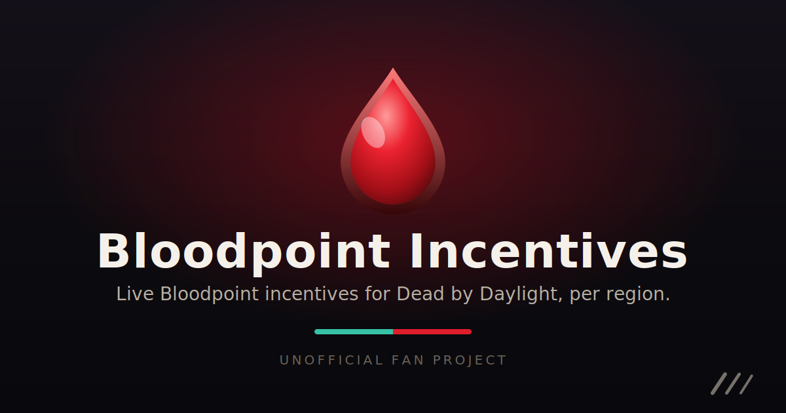

<div align="center">



<a href="LICENSE"></a>


</div>

A small, self-contained web app that shows the **live Bloodpoint incentives** for
_Dead by Daylight_ matchmaking servers: the bonus awarded for playing the
under-populated role, per region and per platform, in a dark, DBD-themed, fully
responsive UI. It serves a **React dashboard**, a **REST API**, and a **live SSE
stream**, all from a single Go/[Huma](https://huma.rocks/) hub fed by one or more
Node agents. Public traffic is fully decoupled from Behaviour's API.

> [!NOTE]
> **Unofficial fan project.** Not affiliated with or endorsed by Behaviour
> Interactive. Agents talk to DBD's private API using a real game account, so they
> are deliberately gentle with it. Use at your own risk.

<br>

## 🧭 How it works

It runs as a **hub** plus one or more **agents**. Each **agent** polls a single
region on a single platform and pushes readings to the hub; the **hub** owns the
poll cadence and agent registry, aggregates readings (keeping the most recent per
region+platform, so redundant agents collapse cleanly), persists history to SQLite,
and is the only thing the browser talks to, live over an SSE stream. See
[How it works](https://docs.bpincentives.com/guide/how-it-works) for the full
picture.

<br>

## ✨ Features

- **All regions** with country flags, **platform-aware** (Steam / Epic /
  Microsoft Store), each showing **both roles in both formats** (`+75%` and `×1.75`)
  with a killer-vs-survivor queue-balance bar and a warm-to-hot colour ramp.
- A **responsive card grid** with search, quick filters, sorting, and pagination,
  all reflected in the URL; **closest-region detection** by latency.
- **Fully translated** into all of Dead by Daylight's supported languages.
- Honest freshness: per-region **stale** badges, a degraded-platform banner, and a
  never-shows-fallback-as-real rule.
- **Redundancy built in:** several agents can cover the same region+platform; the hub
  keeps whichever reported most recently.
- **Per-region history graph** with a zoomable, pannable chart, backed by SQLite so
  readings survive a hub restart, plus a next-24h **bonus forecast**.
- **Automatic version tracking** on each agent, with a cosmetic-patch guard.
- An **optional contribute page** showing coverage and inviting volunteers to run an
  agent.

<br>

## 🚀 Quick start

```bash
cp .env.example .env           # one file drives everything
# Fill in AGENT1_TOKEN + AGENT1_STEAM_USERNAME/PASSWORD (+ SECRET) and AGENT1_REGION.
docker compose up -d           # pulls the published hub + agent images
```

This brings up the hub on `http://localhost:3000` and one agent that reports to it.
On first run the hub has no admin, so it shows a **`/setup`** page to create one.

For the full walkthrough (building images, adding more agents, the env-var
reference), see the [self-hosting guide](https://docs.bpincentives.com/guide/self-hosting).

### 💻 Local development

```bash
npm install
npm run dev          # hub (:3000) + Vite UI (:5173, proxying the API to the hub)
npm run dev:agent    # in another shell, once HUB_URL/AGENT_KEY/Steam creds are set
```

- `npm run dev:hub` runs the hub via `go run ./cmd/hub`.
- `npm run build` builds the web SPA, the agent bundle, and the hub (the hub builds via
  `npm run build:hub`, i.e. `go build -o dist/bloodpoint-hub ./cmd/hub`).
- `npm test` runs the TS unit tests; `go test ./...` (or `npm run test:go`) runs the
  Go tests; `npm run typecheck` checks the TS projects.
- `npm run docs:dev` runs the VitePress documentation site locally.
- Build images directly with `docker build --target hub -t bp-hub .` and
  `docker build --target agent -t bp-agent .` (the Dockerfile has a `hub` and an
  `agent` target).

<br>

## 📚 Documentation

Full documentation, covering self-hosting, running an agent, configuration,
authentication, API keys, the API reference, and the forecasting model, lives at
**[docs.bpincentives.com](https://docs.bpincentives.com)**.

<br>

## 🙏 Acknowledgments

- [**EigenvoidDev**](https://github.com/EigenvoidDev) for the excellent Dead by
  Daylight private API documentation.
- [**CutestLoaf**](https://github.com/CutestLoaf) for the help figuring out how to
  properly call the match-incentives endpoint.

<br>

## 📄 License

[MIT](LICENSE). Dead by Daylight is a trademark of Behaviour Interactive. This project
is an unofficial fan tool and ships no Behaviour assets.
